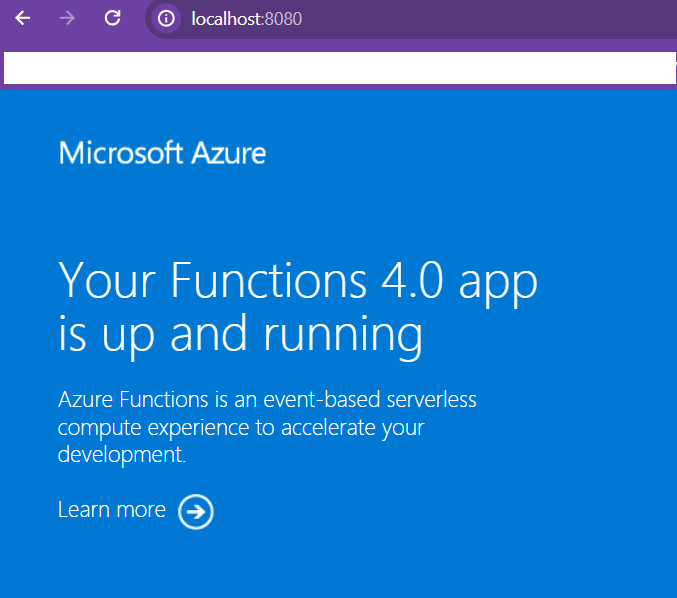

Image Manipulation Azure Function using Python
==============================================
* API that manipulates images
    * Gets image dimensions: /api/v1/dimensions
    * Rescales the image by a scale factor: /api/v1/scale
    * FUTURE: Stripping out location data

## Requests / Responses

### Request via POST submissions via two possible Content-Types:

* multipart/form-data
    * Body for dimensions API
        * image: file from filesystem
    * Body for scale API
        * image: file from filesystem
        * scale: an integer either a plus/minus scale factor
* JSON
- Body for dimensions API

```json
{
    'image': 'base64 encoded string goes here'
}
```

- Body for scale API

```json
{
    'image': 'base64 encoded string goes here',
    'scale': -2
}
```

### Response is JSON, for both Content-Types that are POSTed in the request

- Dimension API Sample

```json
{
    "dimensions": {
        "width": 2592,
        "height": 1936
    }
}
```
 
- Scale API Sample

```json
{
    "original_dimensions": {
        "width": 2592,
        "height": 1936
    },
    "scaled_dimensions": {
        "width": 1296,
        "height": 968
    },
    "scale": -2,
    "img_scaled": "data:image/jpeg;base64, etc base64 encodded string'
}
```

Querying the API
================
* Use scripts from powershell/api folder
* Use Postman collection in postman folder
* Would recommend if user want to see it for a sample run to install docker and run the standup/teardown docker powershell scripts described in this document
* See Postman/Powershell sample usage videos in this document

Unit tests w/pytest
===================
* cd azure_fn_image_manipulation
* run "pytest"
* or open "azure_fn_image_manipulation" in VSCode and run test that way
* pytest runs using CI/CD in github actions with every commit to development and master branches

Requirements
============
* Python 3.11

Windows
=======
### For windows install
1. cd "azure_fn_image_manipulation"
2. py -m venv .venv
3. .\.venv\Scripts\activate
4. .\.venv\Scripts\python.exe -m pip install -r requirements.txt

### Additionally on windows for VSCode
1. ctrl-shift-p
2. Choose "Python: Create Environment"
3. Choose create venv
4. Use the existing python .venv from the .venv path created above
5. To run locally in vscode need Azurite Blob Service plugin running an instance of the test blob service

### To run the azure funtion locally:
* "func host start --python --port 7071" to run using Azure CLI

Local Docker Install Automatic
==============================
1. Have Docker Desktop or other docker service running
2. cd powershell/docker
3. ./standup.ps1 creates and runs the azure function docker container


4. ./teardown.ps1 stops and destroys the azure function docker container


5. After standing it up, you should be able to use the postman collections or powershell scripts to test

Local Docker Install Manual
===========================
1. cd azure_fn_image_manipulation
2. Create dockerfile: "func init --worker-runtime python --language python --docker --name fn_image_manipulation"
3. Use whatever tag you want an imamge name: "docker build --tag fn_image_manipulation:v1 ."
4. run container: "docker run -d -p 8080:80 fn_image_manipulation:v1"
5. see if running: "docker ps"
6. Go to "http://localhost:8080" and make sure get an azure function default response



7. Access running container via: "docker exec -it container_id_from_ps /bin/bash"
8. To access logs use: "docker logs container_id_from_ps
9. Please use docker/external-cloud-Dockerfile for external deploymenets if using docker as docker/local-Dockerfile docker file sets a static x-functions-key

Recordings of Sample Usage with API Working
===========================================

### Powershell Multipart/form-data


### Powershell JSON


### Postman Multipart/form-data


### Postman JSON


